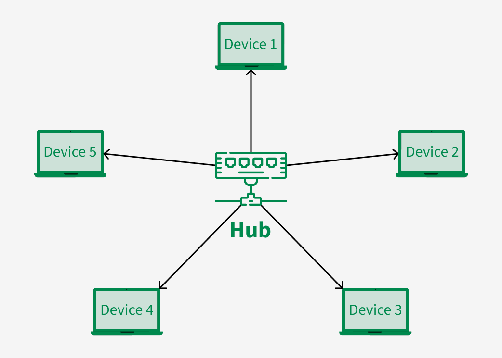
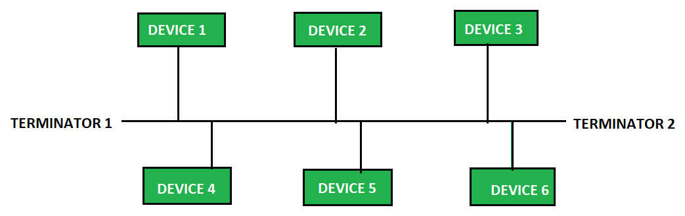
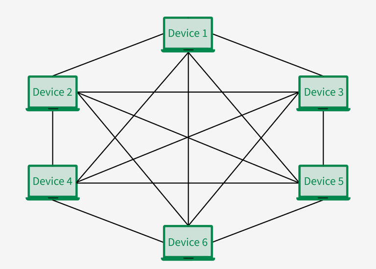

# Network

Networks are categorized by their geographic extent. The three most important are:

- **LAN (Local Area Network)**: Local network
- **WAN (Wide Area Network)**: Connects LANs across large distances. The internet is the world's largest WAN
- **VLAN (Virtual LAN)**: Logical groups inside a physical LAN. Increases the security and reduces unnecessary data traffic

## OSI Model

The Open Systems Interconnection (OSI) model describes how data is transfered from an application on system A to an application on system B.

| Layer | Name | Function | Protocol / Hardware |
| --- | --- | --- | --- |
| 7 | Application | Interface to the software (Browser, mail client) | HTTP, HTTPS, FTP, SMTP |
| 6 | Presentation | Encryption, compression, data formatting | SSL/TLS |
| 5 | Session | Establishing, managing and dismantling connections | NetBios, RPC |
| 4 | Transport | End-to-end data transfer | TCP, UDP |
| 3 | Network | Logical addressing and routing | IPv4, IPv6, ICMP |
| 2 | Data Link | Physical addressing, error detection on cable | MAC-address, ethernet, switch |
| 1 | Physical | Physical component | Copper cable, WLAN, hub |

## Topologies

### Star topology

All devices are connected to a central point (switch). Advantage: If one cable fails, it only affects one device. This is the current standard in LANs.

### Bus topology

All devices are connected to one main cable.

### Mesh topology

Every device is connected to every other device. Advantage: Maximum reliability (redundancy). Disadvantage: Very expensive and complex. Often used in WANs or with critical core routers.

## Hardware

- **Switch (Layer 2)**: It connects devices within a LAN. It remembers the MAC addresses of the connected devices and forwards data packets (frames) only to the specific port containing the target device.
- **Router (Layer 3)**: It connects different networks (e.g., your LAN to the internet). It works with IP addresses and decides which path a data packet must take.
- **Firewall**: Monitors incoming and outgoing traffic based on established safety rules.

## TCP vs. UDP

| Attribute | TCP (Transmission Control Protocol) | UDP (User Datagram Protocol) |
| --- | --- | --- |
| Reliability | High: checks if data is being received | Low |
| Connection establishment | 3-Way-Handshake (SYN, SYN-ACK, ACK) | None |
| Speed | Slower | Very fast |
| User cases | Websites, E-Mail, file transfer | Video streaming, online gaming, VoIP |

## MAC, IP & Ports

A data packet needs three pieces of information to arrive at exactly the right application:

- **MAC-Address**: The physical, unique hardware address of the network card
- **IP-Address**: The logical address
- **Port**: The "door" to the actual application on a server

## The "Big Three" protocols: DHCP, DNS, ARP

- **DHCP (Dynamic Host Configuration Protocol)**: It automatically assigns IP addresses to new devices on the network. Without DHCP, you would have to manually assign an IP address to each smartphone and laptop.
- **DNS (Domain Name System)**: Translates human-readable names (like google.com) into IP addresses (142.250.185.110) that computers understand.
- **ARP (Address Resolution Protocol)**: The translator between Layer 3 and Layer 2. When a computer knows an IP address, it uses ARP to broadcast across the LAN: "Which MAC address belongs to this IP?"

## Subnetting

Subnetworks are created to divide large networks into small, isolated spaces.  
We do this for three reasons:

- **Performance**: Reduction of the "broadcast domains" (less unnecessary data clutter on the network).
- **Security** A firewall can be placed between the subnetworks.
- **Tidiness**: IP addresses are logically grouped by department or location.
