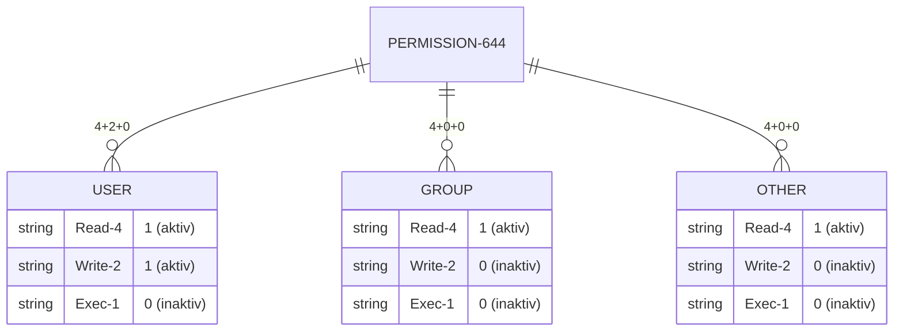

# Filesystem

## Filesystem hierarchy

All files in a Linux system are stored in file systems organized in a single inverted tree structure called the file system hierarchy. This tree structure is inverted because the root of the tree is at the top of the hierarchy, and directories and subdirectories spread out below the root.

The root directory, indicated by a single forward slash (`/`), is the top level of the file system hierarchy. The forward slash (`/`) is also used as a directory separator in filenames.

!!! note "The different content types of file system directories are described using the following terms:"
    - Static content remains unchanged unless explicitly modified or reconfigured.
    - Dynamic or variable content can be modified or added to by active processes.
    - Persistent content persists after a system restart.
    - Runtime content from a process or the system is deleted upon restart.

### Important directories in RHEL

| Storage location | Purpose |
| --- | --- |
| `/boot` | Files for the startup process |
| `/dev` | Special device files used by the system to access hardware |
| `/etc` | System specific configuration files |
| `/home` | User directory for regular users |
| `/root` | User directory for superusers |
| `/run` | Runtime data for processes that have been started since the last startup operation |
| `/tmp` | Storage space for temporary files |
| `/usr` | Installed software, shared libraries, including files and read-only program data |
| `/var` | System-specific variable data that should be retained between startup processes |

## Creating links between files

You can create multiple filenames that point to the same file. These filenames are called links.

You can create two types of links: a hard link or a symbolic link (sometimes called a soft link). Each type of link is useful for different use cases.

### Hard links

Every file begins with a single hard link from its original name to the data in the file system. When you create a hard link to a file, you create a different name that points to the same data. The new hard link behaves exactly like the original file name. Once created, you cannot tell the difference between the new hard link and the original file name.

To determine if two files are hard-linked, use the `ls` command with the `-i` option to list the inode number of each file. If the files are in the same file system and their inode numbers are the same, then the files are hard links pointing to the same file content.

!!! warning "Hard links have some limitations. First, hard links can only be used with regular files. You cannot use the `ln` command to create a hard link to a directory or a specific file. Second, hard links can only be used if both files reside in the same file system. The file system hierarchy can span multiple storage devices. Depending on your system configuration, this directory and its contents might be stored on a different file system when you navigate to a new directory."

### Symbolic links

The `ln` command with the `-s` option creates a symbolic link, also known as a soft link. A symbolic link is not a regular file, but a special type of file that points to an existing file or directory.

- Symbolic links can connect two files in different systems
- Symbolic links can point to a directory or a specific file, in addition to a regular file

!!! tip "A symbolic link can point to a directory. The symbolic link then behaves like a directory. When you change to the symbolic link using the `cd` command, the current working directory becomes the linked directory."

## Filesystem permissions

Filesystem permissions control the access to files. Linux filesystem permissions are flexible and are suitable for most use cases.

Owner of a file is a user. Usually the one, that created the file. Over and beyond also a group is owner of a file. Usually the primary group of the user, that created the file.

Files have three user categories, for which permissions apply:

- User permissions
- Group permissions
- Other

For each category, different permissions can be set. There are three permission-types:

| Permission | Impact on files | Impact on directories |
| --- | --- | --- |
| `r` (read) | File content can be read | Directory content can be displayed |
| `w` (write) | File content can be edited | All files in the directory can be created or deleted |
| `x` (execute) | Files can be executed as commands | The directory can become the current working directory |

### Displaying file and directory permissions and ownership

The `-l` option of the `ls` command displays detailed information about permissions and ownership:

```bash
ls -l example # -rw-rw-r--. 1 student student 0 Mar  16 14:36 example
```

Use the `ls` command with the `-d` option to display detailed information about a directory itself, rather than its contents: 

```bash
ls -ld /example # drwxr-xr-x. 5 root root 4096 Mar 16 14:37 /example
```

??? example "Output breakdown"
    - The first character is the file type:
        - `-`: Regular file
        - `d`: Directory
        - `l`: Symbolic link
        - `c`: Character-oriented device file
        - `b`: Block-oriented device file
        - `p`: Named pipe file
        - `s`: Local socket file
    - The next nine characters represent the file permissions:
        - The first set of permissions applies to the file owner
        - The second set applies for the group owner of the file
        - The last set applies to every other user
    - The second column indicates the number of links
    - The first name indicates the owner of the file
    - The second name indicates the group owner of the file

### Manage file permissions

You can configure file and directory permissions to define access for different user groups. The most important tool for configuring these permissions is the `chmod` command. `chmod` stands for "change mode", where "mode" refers to the permissions of a file. The standard syntax is:

```bash
chmod WHO/WHAT/WHICH <file>|<directory>
```

| WHO | User class | Description |
| --- | --- | --- |
| `u` | `user` | File owner |
| `g` | `group` | File group |
| `o` | `other` | Every other user |
| `a` | `all` | Every user |

| WHAT | Operation | Description |
| --- | --- | --- |
| `+` | `add` | Add permissions |
| `-` | `remove` | Remove permissions |
| `=` | `set exactly` | Sets the exact given permissions |

| WHICH | Mode | Description |
| --- | --- | --- |
| `r` | `read` | Reading permissions to a file, displaying permissions to a directory |
| `w` | `write` | Writing permissions to a file or directory |
| `x` | `execute` | Execution permissions to a file, allowed to enter the directory and access files and subdirectories within the directory |
| `X` | `special execute` | Execution permissions for a directory or execution permissions for a file if at least one of the execute bits is set |

??? example "Examples"
    ```bash
    chmod go-rw document.txt
    ```
    ```bash
    chmod a+x script.sh
    ```
    ```bash
    chmod -R g+rwx /home/user/folder
    ```

#### Changing permissions using the octal method

You can use the `chmod` command to change file permissions using the octal method instead of the symbolic method. In the octal method, permissions are represented by a 3-digit octal number. (For extended permissions, it can also be 4 digits.)

In the 3-digit octal representation of permissions, each digit represents an access level; from left to right: User, Group, and Other. Here's how to determine each digit:



??? example "Examples"
    ```bash
    chmod 644 document.txt
    ```
    ```bash
    chmod 750 script.sh
    ```
    ```bash
    chmod -R 640 /home/user/folder
    ```
